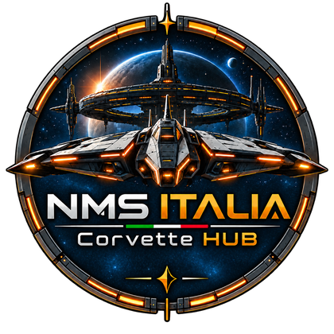
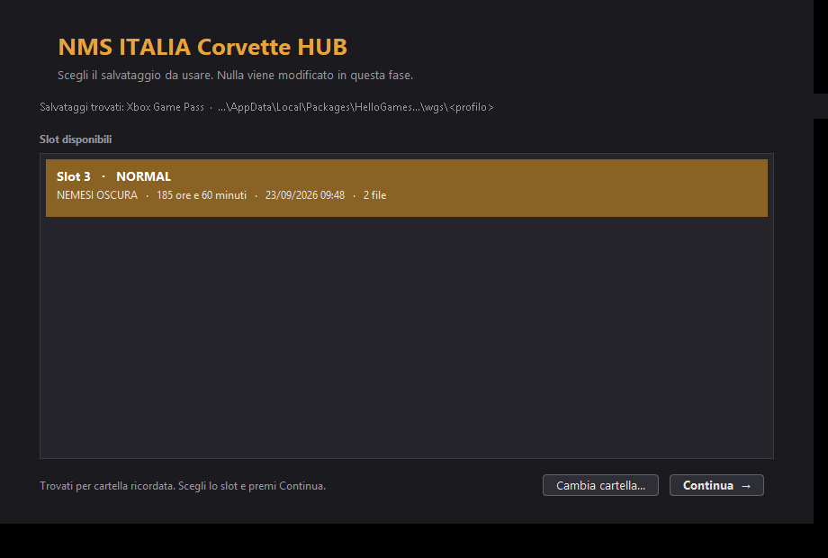
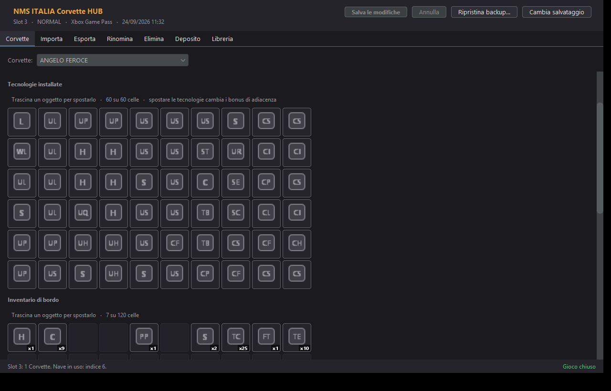
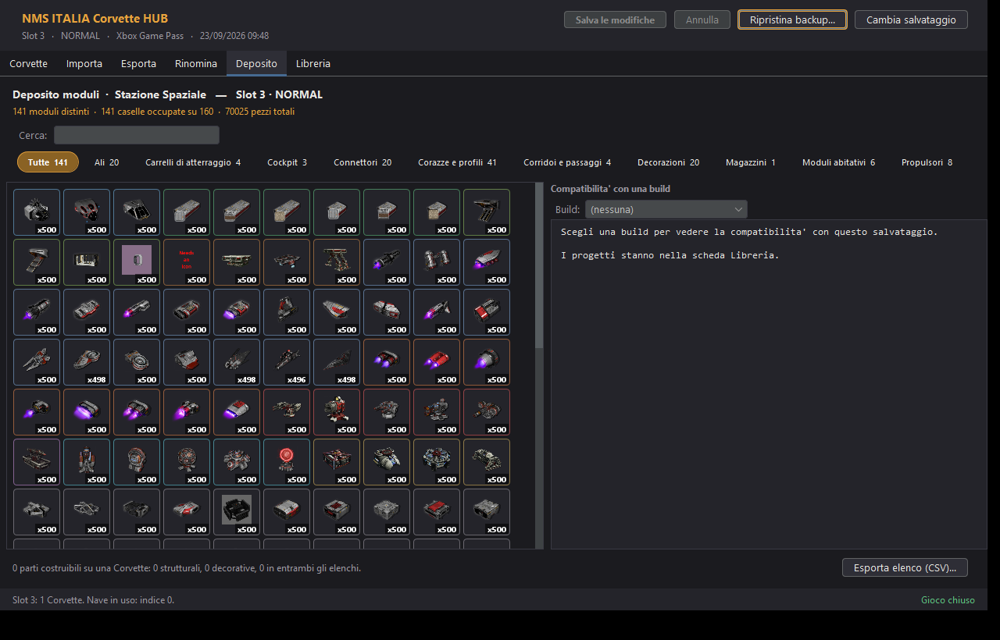
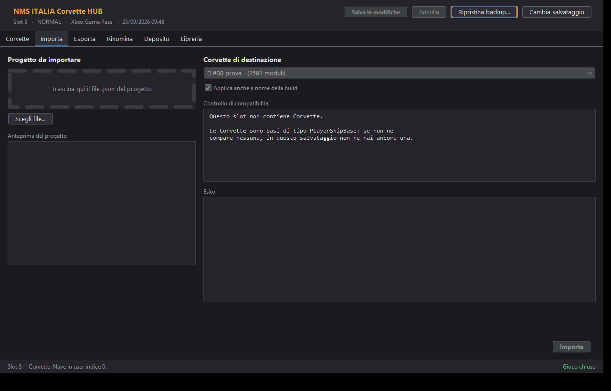
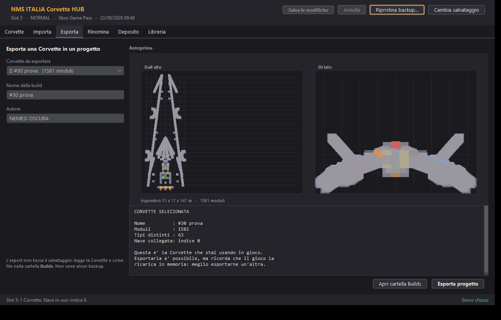
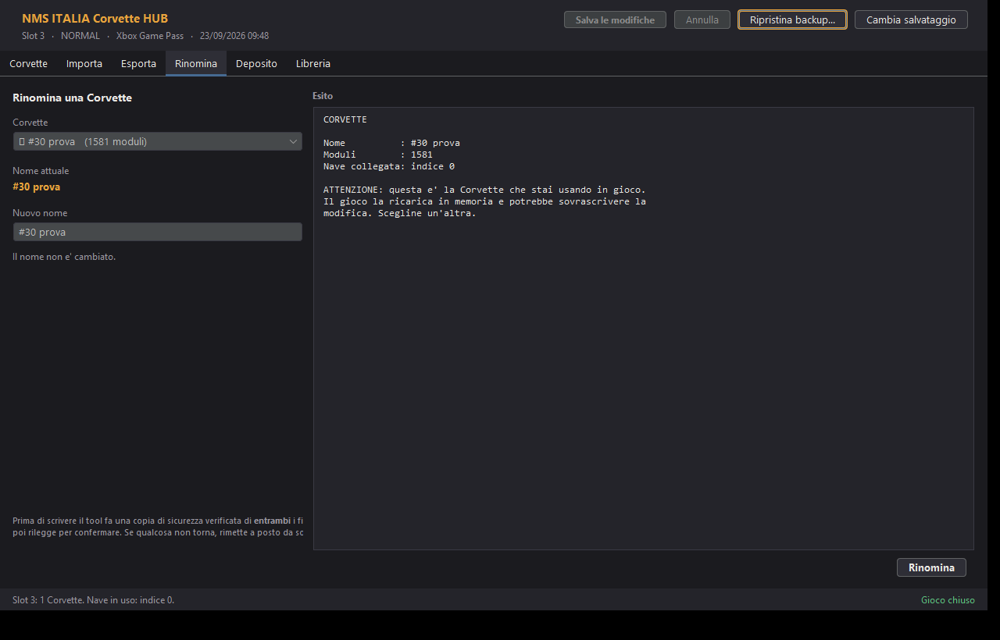
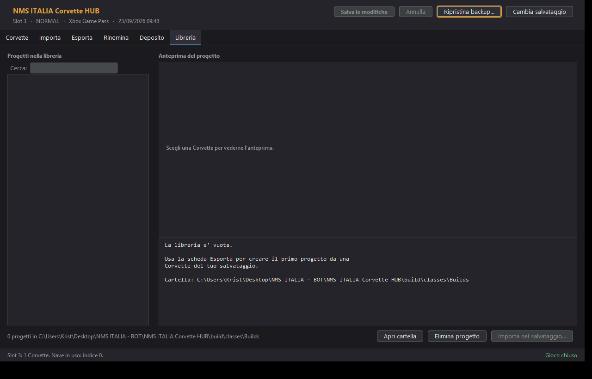

<div align="center">



# NMS ITALIA Corvette HUB

**Scambia le tue Corvette con gli altri giocatori.**

Applicazione desktop per Windows, dedicata esclusivamente alle Corvette di
No Man's Sky.

[](LICENSE)
[](../../releases)
[](#-requisiti)
[](https://discord.gg/ZPwrQuATC4)

**[Entra nel Discord di NMS ITALIA](https://discord.gg/ZPwrQuATC4)** ·
[Scarica](#-come-si-avvia) ·
[Segnala un problema](../../issues)

</div>

---

## Cos'è

Un tool che fa quattro cose e nient'altro:

| | |
|---|---|
| **Importa** | porta un progetto di Corvette dentro una Corvette del tuo salvataggio |
| **Esporta** | estrae una Corvette in un file condivisibile |
| **Rinomina** | cambia il nome di una Corvette |
| **Consultare** | i moduli della Stazione Spaziale, le tecnologie installate, i depositi delle basi |

Il deposito si **legge e basta**: il tool non sblocca, non aggiunge e non
riempie nulla. È uno scambio di progetti tra giocatori, non un editor
generalista.

---

## Screenshot

**Scelta del salvataggio.** Prima si decide su quale partita lavorare, poi si
lavora. Qui non si vede nulla delle Corvette: solo dove sono i salvataggi e
quali slot esistono.



**La Corvette.** Statistiche, le tecnologie installate con le icone del gioco,
l'inventario, i depositi montati. Gli oggetti si spostano trascinandoli.



**Il deposito.** I moduli della Stazione Spaziale a griglia, con le icone
ufficiali, il filtro per categoria e la ricerca.



**L'importazione.** Si trascina il file, si vede l'anteprima e **il controllo
di compatibilità prima di scrivere**: il tool dice cosa hai, cosa hai sbloccato
e cosa ti manca.



<details>
<summary>Altre schermate: esportazione, rinomina, libreria</summary>

**Esporta** — estrae una Corvette in un progetto, con anteprima disegnata dalle
posizioni reali dei moduli.



**Rinomina** — la prima operazione che scrive, con backup e verifica.



**Libreria** — i progetti che hai esportato, con ricerca e anteprima.



</details>

---

## Come si avvia

1. Scarica l'ultima versione dalla pagina [Releases](../../releases)
2. Scompatta l'archivio dove vuoi
3. Doppio clic su **`CorvetteHUB.bat`**

**Non devi installare Java**: il pacchetto include già il proprio runtime.

Se Windows chiede conferma (*"Windows ha protetto il PC"*), scegli **Ulteriori
informazioni** e poi **Esegui comunque**: succede con i programmi scaricati da
Internet che non hanno una firma digitale.

Al primo avvio, accanto al programma vengono creati:

| Cosa | Perché |
|---|---|
| `CorvetteHUB.conf` | ricorda la cartella dei salvataggi scelta |
| `Builds/` | la libreria dei progetti esportati |
| `Backup/` | i backup, con data e ora |

### Se vuoi l'icona sul Desktop

Nella cartella c'è `Crea collegamento sul Desktop.bat`: lancialo una volta e
avrai un collegamento con il logo, invece dell'icona generica di Windows.

---

## Requisiti

- **Windows**
- **No Man's Sky su PC**: Steam, GOG, Epic oppure app Xbox

Il programma riconosce da solo dove sono i salvataggi. Se non li trova, il
pulsante **Cambia cartella** permette di indicarli a mano: la scelta viene
ricordata.

---

## Sicurezza dei salvataggi

Questa è la parte a cui tengo di più, perché qui si scrive dentro i salvataggi
delle persone.

**Prima di ogni scrittura:**

- il gioco deve essere **chiuso** — il tool lo controlla e blocca l'operazione
- viene fatta una **copia di sicurezza verificata con SHA-256**; se la copia non
  riesce, non viene scritto nulla
- la Corvette **in uso** non compare nell'elenco: il gioco la ricarica in
  memoria e sovrascriverebbe la modifica

**Dopo la scrittura:**

- il file viene **riletto e confrontato byte per byte**
- se qualcosa non torna, il tool **rimette a posto il backup da solo**

**Il ripristino** è a un pulsante di distanza: `Ripristina backup...` rimette a
posto i file da un backup scelto. Anche il ripristino, prima di toccare
qualcosa, salva lo stato attuale — se il backup fosse vecchio si può tornare
indietro.

I backup stanno in `Backup/AAAA-MM-GG_HH-MM-SS/`, con le impronte SHA-256
annotate in `backup.txt`.

---

## Cosa il tool NON fa, per scelta

- Non sblocca moduli, prodotti o parti nella Stazione Spaziale
- Non modifica classi, statistiche, inventari, potenziamenti, proprietario o
  slot di una Corvette
- Non tocca navi che non siano Corvette
- Non modifica valuta, naniti, quicksilver, reputazione o traguardi
- Non ha nessuna forma di "unlock tutto", trainer o cheat

**Questa non è una promessa sulla fiducia: è un vincolo tecnico.** Le funzioni
di sblocco vivono nella classe `nomanssave.gz` dell'editor da cui deriva il
parser, e quella classe **non è inclusa** nelle librerie di questo progetto.
Non essendoci, non sono raggiungibili nemmeno per errore.

---

## Limiti noti

**Lettura e scrittura funzionano su tutte le piattaforme PC.** Le due famiglie
di salvataggi sono fatte in modo diverso, e il tool le tratta in modo diverso:

| Piattaforma | Com'è fatto un salvataggio | Come si scrive |
|---|---|---|
| **Steam, GOG, Epic** | un file `save*.hg` per slot, più il manifest `mf_save*.hg` | il file viene riscritto e il manifest aggiornato con nome, ore di gioco, dimensione e impronte |
| **App Xbox per PC** | contenitori con `containers.index` e descrittore | payload e descrittore riscritti, entrambi i file dello slot |

Il manifest è la parte delicata del formato a file singoli: contiene i metadati
che il gioco mostra nel menu dei salvataggi. Se restasse quello vecchio, il
gioco leggerebbe nome e ore di gioco sbagliati.

**Altri limiti:**

- Il ripristino riconosce i contenitori dal nome della cartella. Se il gioco ha
  cambiato i nomi dei file, i vecchi vengono rimessi accanto ai nuovi: lo stato
  torna quello del backup, ma nella cartella restano dei file che il gioco non
  usa più.
- Le statistiche della Corvette si leggono ma non si modificano.
- **La scrittura su Steam è nuova.** Il ciclo è stato verificato su una copia,
  ma la conferma in gioco da parte di chi gioca su Steam è ancora da fare. Se
  qualcosa non va, il backup è automatico.

---

## Come è organizzato: due schermate

Il programma non mette tutto in una schermata sola. Prima si decide **su quale
partita** si lavora, poi si lavora.

**Schermata 1 — Scelta del salvataggio.** Si sceglie lo slot e si preme
*Continua*.

**Schermata 2 — Hub della Corvette.** Sei schede:

| Scheda | Cosa fa |
|---|---|
| **Corvette** | statistiche, tecnologie installate, inventario, depositi montati |
| **Importa** | porta un progetto dentro una Corvette, con controllo di compatibilità |
| **Esporta** | estrae una Corvette in un progetto condivisibile, con anteprima |
| **Rinomina** | cambia il nome di una Corvette, con backup e verifica |
| **Deposito** | moduli della Stazione Spaziale, a griglia, con icone e filtri |
| **Libreria** | i progetti salvati, con anteprima, ricerca ed eliminazione |

In alto resta sempre scritto su quale slot si sta lavorando, e il pulsante
**Cambia salvataggio** riporta alla prima schermata.

### Spostare gli oggetti

Si trascina in tre posti: **l'inventario di bordo**, le **tecnologie
installate** e il **deposito**. Mentre muovi, l'icona segue il puntatore. Se la
cella è occupata, i due oggetti si scambiano di posto.

Quando sposti qualcosa compare una fascia gialla con quanti oggetti hai mosso,
e **in alto a destra si accendono due pulsanti**: *Salva le modifiche* e
*Annulla*. Finché non premi *Salva* non viene scritto niente.

**Nessun oggetto viene creato o perso.** Spostare significa cambiare la
*coordinata* dell'oggetto, non toglierlo e rimetterlo: il tool controlla che il
numero di oggetti prima e dopo sia identico e, se non lo fosse, non scrive.

Due avvertenze:

- **Spostare le tecnologie cambia i bonus di adiacenza**, quindi anche le
  statistiche della nave. È una modifica con effetti sul gioco.
- Nel **deposito**, se hai un filtro attivo la griglia non è trascinabile: le
  posizioni che vedi non sarebbero quelle vere. Togli il filtro per spostare.

---

## Il contatore del deposito: 661, non 664

Il catalogo delle parti costruibili su una Corvette si ricava da
`basebuildingobjectstable` del gioco:

| | |
|---|---|
| costruibili come **strutturali** | 622 |
| costruibili come **decorative** | 42 |
| presenti in **entrambi** gli elenchi | 3 |
| **totale distinto** | **661** |

Sommare 622 e 42 darebbe 664, ma conterebbe tre parti due volte. Il contatore
del deposito usa **661** come denominatore e tiene la distinzione strutturale /
decorativa.

---

## Struttura del progetto

```
NMS ITALIA Corvette HUB/
├── NMSITALIA-CorvetteHUB.jar   il programma (1 MB)
├── CorvetteHUB.bat             avvio
├── lib/
│   ├── nms-parser.jar          conversione dei salvataggi (0,55 MB)
│   ├── flatlaf.jar             tema grafico (0,85 MB)
│   └── nms-icons.jar           icone del gioco (66 MB)
├── jre/                        runtime Java incluso (non nel repository)
├── res/                        catalogo delle parti, logo, icone dell'app
├── src/                        sorgenti del programma
├── src-stub/                   segnaposto tecnico, vedi sotto
├── tools/ecj.jar               compilatore
├── docs/                       note tecniche e immagini
├── LICENSE                     Apache 2.0
├── NOTICE                      attribuzioni del materiale di terzi
├── PIANO.md                    piano e fatti verificati
└── _tmp/                       materiale di lavoro, non va distribuito
```

### Compilare dai sorgenti

Serve un JDK (per `javac`/`jar`) e il compilatore `tools/ecj.jar`:

```bash
JAVA="<percorso-jdk>/bin/java.exe"
JARX="<percorso-jdk>/bin/jar.exe"

find src -name "*.java" > sources.txt
echo "src-stub/nomanssave/Application.java" >> sources.txt

"$JAVA" -jar tools/ecj.jar -encoding UTF-8 -source 1.8 -target 1.8 -warn:none \
  -cp "lib/nms-parser.jar;lib/flatlaf.jar" -d build/classes "@sources.txt"

"$JARX" cfm NMSITALIA-CorvetteHUB.jar build/MANIFEST.MF \
  -C build/classes . -C . res
```

**Attenzione**: prima di impacchettare, assicurati che `build/classes` non
contenga `Backup/`, `Builds/` o i log — altrimenti il JAR diventa enorme.

---

## Note tecniche

### Il parser condiviso

`lib/nms-parser.jar` contiene 73 classi estratte da `Atlante.jar` più 12 classi
della libreria LZ4 e le risorse `nomanssave/db/`. È la chiusura completa delle
dipendenze delle classi di conversione: nulla di più.

Attenzione a un dettaglio che costa tempo se lo si scopre tardi: nel JAR di
Atlante ci sono **208 coppie di classi che differiscono solo per maiuscole**
(`nomanssave/a.class` e `nomanssave/A.class` sono classi diverse). Estrarre il
JAR su Windows le sovrascrive a vicenda e si ottengono classi sbagliate. La
libreria va costruita leggendo gli archivi direttamente, mai passando dal
filesystem.

### Il segnaposto `nomanssave.Application`

La classe `nomanssave.eC`, che carica il dizionario delle chiavi di
salvataggio, risolve il percorso delle proprie risorse partendo da
`Application.class`. Senza quella classe la conversione di **qualunque**
salvataggio fallisce con `NoClassDefFoundError`.

`src-stub/nomanssave/Application.java` è un segnaposto scritto apposta per
questo: non è una copia di `Application`, non crea finestre, non contiene
nessuna scheda dell'editor. Fornisce solo ciò che serve al caricamento delle
risorse.

### Le icone del gioco

`lib/nms-icons.jar` contiene **3210 icone** estratte dall'installazione,
nominate per identificativo dell'oggetto:

| Prefisso | Quantità | Cosa sono |
|---|---|---|
| `PRODUCT-` | 2806 | prodotti, moduli di costruzione, parti di Corvette |
| `TECHNOLOGY-` | 247 | tecnologie e potenziamenti |
| `SUBSTANCE-` | 100 | elementi e materiali |
| `TECHBOX-` | 24 | moduli tecnologici |
| `UI-` | 33 | icone di interfaccia |

Si caricano come risorsa dal percorso `nomanssave/icons/PRODUCT-<ID>.PNG`, dove
`<ID>` è lo stesso identificativo che compare nel salvataggio (es.
`PRODUCT-B_COK_A.PNG` per il cockpit A).

I moduli di potenziamento non hanno un disegno proprio: il gioco, per un modulo
installato, mostra il disegno della **tecnologia base** a cui appartiene. Il
programma fa lo stesso, riconoscendo la famiglia dal nome (`UP_HYP4` →
iperguida, `UP_S_SHL4` → scudi).

### Fatti verificati sul campo

Sono annotati tutti in `PIANO.md`, con il percorso del file o il comando che li
dimostra. I più importanti:

- La Corvette è una **base** in `PersistentPlayerBases[]` con
  `BaseType.PersistentBaseTypes == "PlayerShipBase"`; `UserData` è l'indice in
  `ShipOwnership[]`; il nome sta in `base.Name`; i moduli in `base.Objects[]`
- La nave in uso è `PlayerStateData.PrimaryShip`
- Le ore di gioco stanno in `CommonStateData.TotalPlayTime`, in **secondi**
  (non in `PlayerStateData`, come suggerirebbe il codice dell'editor)
- Le tecnologie della Corvette stanno in `ShipOwnership[i].Inventory_TechOnly`,
  con voci di tipo `Technology`
- I depositi delle basi stanno in `Chest1Inventory` … `Chest10Inventory`, e
  nell'elenco `Objects` della base compaiono i moduli `^CONTAINER0` … `^CONTAINER9`
  che li rendono visibili in gioco

---

## Come è stato sviluppato

Questo progetto è stato sviluppato **con l'aiuto dell'intelligenza
artificiale**, e mi pare giusto dirlo chiaramente invece di lasciarlo
intendere.

Le scelte di merito sono umane: cosa il tool deve fare e cosa non deve fare,
come trattare i salvataggi altrui, quando una scrittura è abbastanza sicura da
essere proposta a un giocatore. Il codice è stato scritto in gran parte
dall'IA, che ha anche fatto la ricognizione sul formato dei salvataggi e le
verifiche.

Niente è stato preso per buono senza controllo: ogni affermazione sul formato
dei salvataggi in `PIANO.md` ha accanto il comando o il file che la dimostra, e
le funzioni che scrivono sono state provate su copie prima di arrivare ai
salvataggi veri.

Se qualcosa non funziona come dovrebbe, la colpa non è "dell'IA": è di chi ha
pubblicato senza verificare abbastanza. Le segnalazioni sono benvenute.

---

## Domande, problemi, proposte

Passa dal **Discord di NMS ITALIA**: <https://discord.gg/ZPwrQuATC4>

Per un bug, apri una [issue](../../issues) e allega il file
`CorvetteHUB.log` e `CorvetteHUB-console.log`: dicono cosa è stato fatto e
com'è finita.

---

## Licenza

**Apache License 2.0** — vedi [LICENSE](LICENSE).

In pratica: il software è gratuito, puoi usarlo, modificarlo e ridistribuirlo,
anche per scopi commerciali. In cambio **devi citare l'autore** e conservare
l'avviso di copyright: se usi questo software o parte di esso in qualcosa,
indica che deriva da **NMS ITALIA Corvette HUB di Sbri**.

Le attribuzioni del materiale di terzi sono in [NOTICE](NOTICE):

- `lib/nms-parser.jar` — logica del formato dei salvataggi ricostruita dal
  lavoro di **Brendon Matthews (GoatFungus)**
- `lib/flatlaf.jar` — **FlatLaf** di FormDev Software GmbH (Apache 2.0)
- `jre/` — **Eclipse Temurin** (OpenJDK 8) di Eclipse Adoptium
- `lib/nms-icons.jar` — icone estratte da un'installazione di No Man's Sky

---

<div align="center">

**No Man's Sky** e tutte le sue risorse sono marchi di **Hello Games**.

Questo progetto non è affiliato a Hello Games e non è approvato da Hello Games.

<br>

Fatto con passione per la community italiana di No Man's Sky.

**[Discord di NMS ITALIA](https://discord.gg/ZPwrQuATC4)**

</div>
